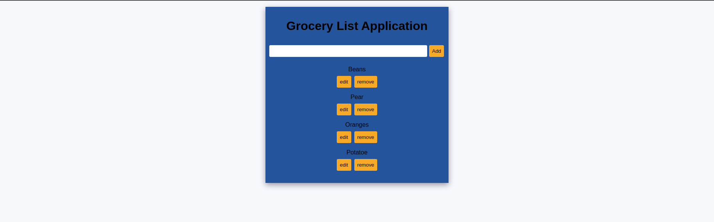

# grocery-list-application

## App

## About

This is a simple grocery list application.
Users are able to add, update and delete each list item.

## Build With

- Javascript
- HTML
- CSS

### Prerequisites

Knowledge about JS:

- Basic data structures
- Arrays
- Functions

## Clone project

- To get a local copy up and running follow these simple example steps.
- Clone this repository with `https://github.com/abuemkezeChu/grocery-list-application.git` using your terminal or command line.
- Change to the project directory by entering: cd grocery-list-application in the terminal.

## Command line steps

- $ git clone `$ https://github.com/abuemkezeChu/grocery-list-application.git`
- $ `cd grocery-list-application`
- $ `git checkout feature

## Live Site

[grocery-list-application](https://abuemkezechu.github.io/grocery-list-application/)

## Author

👤 **Abuemkeze Chu**

- GitHub: [@abuemkezeChu](https://github.com/abuemkezeChu)
- Twitter: [@abuemkeze](https://twitter.com/abuemkeze)
